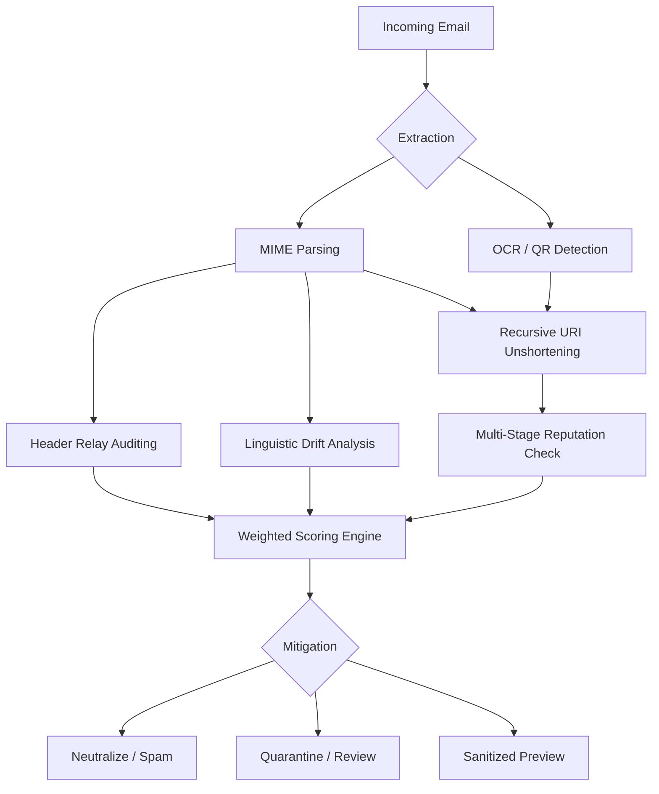

# 🛡️ Gmail Real-Time Cybersecurity Scanner

[](https://cloud.google.com/vision)
[](https://developers.google.com/apps-script)
[](https://nodejs.org/)
[](https://opensource.org/licenses/MIT)

> **In-Situ Defense:** A multi-dimensional cybersecurity engine for Gmail that detects and neutralizes 2026-grade threats before they reach the user.

---

## 🚀 Analysis Pipeline



---

## ⚡ Fast-Track Deployment

1.  **Clone the Repository:**
    ```bash
    git clone https://github.com/your-repo/gmail-security-scanner.git
    cd gmail-security-scanner
    ```
2.  **Configure API Keys:**
    - Create a GCP Project and enable Safe Browsing, Cloud Vision, and VirusTotal APIs.
    - Set keys in `PropertiesService` via the Apps Script editor:
      - `SAFE_BROWSING_API_KEY`
      - `CLOUD_VISION_API_KEY`
      - `VIRUSTOTAL_API_KEY`
3.  **Deploy with Clasp:**
    ```bash
    clasp login
    clasp push
    ```

---

## 🧠 Intelligence & Scoring Model

The scanner utilizes a non-linear composite scoring formula ($S$) to assess threat severity.

$$S = 100 - (\sum w_i \cdot I_i) \cdot M$$

| Weight ($w_i$) | Indicator ($I_i$) | Threat Type |
| :--- | :--- | :--- |
| 80 | Malware / Suspicious PDF | **Critical** |
| 60 | Malicious / Homograph URL | **High** |
| 40 | DMARC Failure | **Critical Spoofing** |
| 35 | Relay Path Anomaly | **Brand Spoofing** |
| 25 | Malicious QR Link | **Quishing** |
| 15-20 | Linguistic Pressure (BEC) | **Social Engineering** |

**Non-Linear Multipliers ($M$):**
- **Critical Combo (1.5x):** Triggered when a DMARC failure coincides with a malicious URL.
- **High Voltage (1.25x):** Triggered by multiple high-pressure lures from an unverified sender.

---

## 🛡️ Advanced Defensive Modules

-   **Key-Hunter (Autonomous Decryption):** Identifies passwords in email bodies to decrypt ZIP attachments for deep inspection.
-   **Shield-Layer (Prompt Injection Firewall):** Neutralizes LLM "jailbreak" attempts within emails before analysis.
-   **Smart OCR Pipeline:** Cost-optimized vision analysis that filters small images and batches requests for QR detection.
-   **Reverse-Chain Relay Auditor:** Inspects the full `Received` header chain against trusted CIDR blocks to detect internal spoofing.
-   **Magic Byte Verification:** Verifies actual file types (PDF, ZIP, EXE) regardless of extension to prevent double-extension attacks.

---

## ⚠️ Critical Limits & Operations

-   **Execution Timeout:** The scanner handles large threads by implementing a sliding-window rate analyzer and state persistence via `CacheService`.
-   **Privacy-by-Design:** All data processing occurs *In-Situ* within your Google Cloud tenant. No email content or PII is ever transmitted to external 3rd-party servers (excluding reputation API lookups).

---

## 🛠️ Gemini CLI Extension (MCP)

For security analysts, the included Node.js MCP server provides a terminal-based bridge for advanced threat hunting.

```bash
# Start the MCP server
npm install
npm run start:mcp
```

---

## 🤝 Contribution & Debugging

-   **Security Disclosure:** Please report any logic bypasses via the [Security Policy](SECURITY.md).
-   **Logs:** Access real-time analysis logs via the Apps Script dashboard or Google Cloud Logging (Stackdriver).
